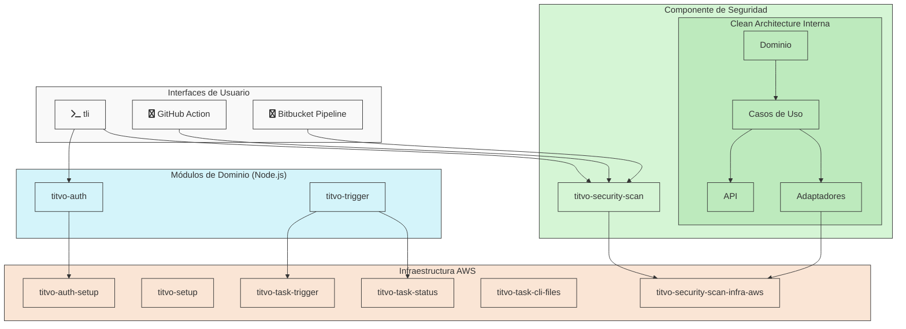

# Proyecto Titvo - Índice de Repositorios
https://www.titvo.com

Proyecto Open Source que contiene un sistema que analiza automáticamente commits de GitHub, Bitbucket o archivos enviados por CLI en busca de vulnerabilidades de seguridad utilizando modelos avanzados de LLM.

Este repositorio sirve como punto de entrada para navegar por los diferentes componentes del ecosistema Titvo.

## Arquitectura General

Titvo está construido siguiendo principios de arquitectura limpia, con diferentes componentes que cumplen roles específicos en el sistema.

## Componentes del Sistema

### Módulos de Dominio (Node.js)

Repositorios que contienen la lógica de negocio pura siguiendo principios de Clean Architecture:

| Repositorio | Descripción |
|-------------|-------------|
| [titvo-auth](https://github.com/KaribuLab/titvo-auth) | Lógica de dominio del servicio de autenticación |
| [titvo-trigger](https://github.com/KaribuLab/titvo-trigger) | Lógica de dominio para iniciar procesos de análisis |

### Implementaciones de Infraestructura (AWS)

Repositorios que implementan la infraestructura específica acoplada a AWS:

| Repositorio | Descripción |
|-------------|-------------|
| [titvo-auth-setup](https://github.com/KaribuLab/titvo-auth-setup) | Infraestructura AWS para el servicio de autenticación |
| [titvo-setup](https://github.com/KaribuLab/titvo-setup) | Infraestructura AWS para configuración general |
| [titvo-task-cli-files](https://github.com/KaribuLab/titvo-task-cli-files) | Infraestructura AWS para archivos CLI |
| [titvo-task-trigger](https://github.com/KaribuLab/titvo-task-trigger) | Infraestructura AWS para disparadores específicos de tareas |
| [titvo-task-status](https://github.com/KaribuLab/titvo-task-status) | Infraestructura AWS para seguimiento del estado de tareas |
| [titvo-security-scan-infra-aws](https://github.com/KaribuLab/titvo-security-scan-infra-aws) | Infraestructura AWS para el motor de escaneo |

### Componente de Seguridad

| Repositorio | Descripción |
|-------------|-------------|
| [titvo-security-scan](https://github.com/KaribuLab/titvo-security-scan) | Motor de escaneo de seguridad con implementación interna de Clean Architecture |

### Interfaces de Usuario

Puntos de entrada al sistema desde diferentes plataformas:

| Repositorio | Descripción |
|-------------|-------------|
| [tli](https://github.com/KaribuLab/tli) | CLI de seguridad para desarrollo (Go) |
| [titvo-security-scan-action](https://github.com/KaribuLab/titvo-security-scan-action) | GitHub Action para escaneos de seguridad |
| [titvo-security-scan-pipe](https://bitbucket.org/karibu-cl/titvo-security-scan-pipe/src/main/) | Pipeline de Bitbucket para escaneos de seguridad |

## Diagrama de Arquitectura

## Uso de la Herramienta CLI (tli)

[tli](https://github.com/KaribuLab/tli) es una herramienta de línea de comandos para escanear código fuente en busca de problemas de seguridad.

Para más detalles sobre el uso y funcionalidades de tli, consulta el [repositorio oficial](https://github.com/KaribuLab/tli).

## Contribuciones

Para contribuir a cualquiera de los proyectos:

1. Crear un fork del repositorio específico
2. Crear una rama para tu funcionalidad (`git checkout -b feature/amazing-feature`)
3. Hacer commit de tus cambios (`git commit -m 'feat: agregar nueva funcionalidad'`)
4. Enviar la rama (`git push origin feature/amazing-feature`)
5. Abrir un Pull Request

## Licencia

Los proyectos Titvo se distribuyen bajo la licencia Apache 2.0. Consulta el archivo `LICENSE` en cada repositorio para más detalles.
