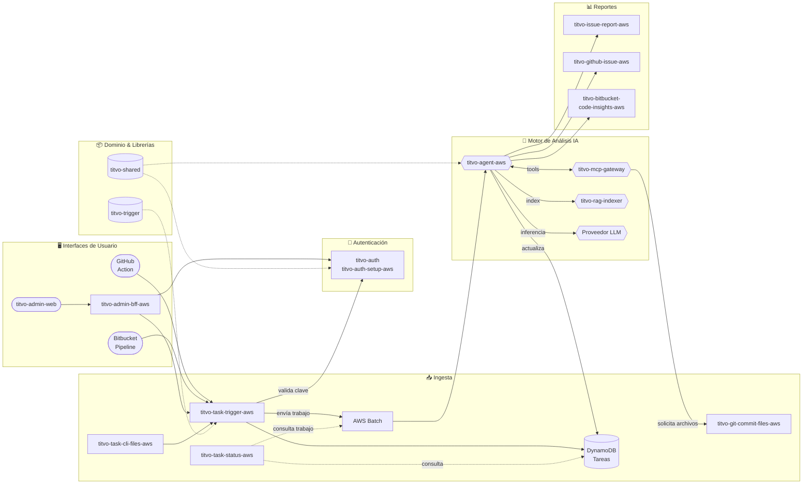

# Titvo — Índice de Repositorios

https://www.titvo.com

Plataforma Open Source de DevSecOps que analiza automáticamente commits de GitHub y Bitbucket en busca de vulnerabilidades de seguridad, utilizando modelos de LLM configurables, herramientas MCP y RAG opcional para análisis contextual.

> **Punto de entrada al ecosistema:** este repositorio navega todos los componentes. Para desplegar Titvo en tu cuenta AWS, usa el [**titvo-installer**](https://github.com/KaribuLab/titvo-installer).

---

## Inicio Rápido: Instalador

El instalador automatiza el despliegue completo de Titvo en tu cuenta AWS. Descarga herramientas (Terraform, Terragrunt, Node.js), crea toda la infraestructura y genera tu primera API Key.

👉 **[titvo-installer](https://github.com/KaribuLab/titvo-installer)** — lee el README del instalador para instrucciones detalladas.

---

## Diagrama de Arquitectura

```mermaid
flowchart LR
    subgraph Interfaces["🖥️  Interfaces de Usuario"]
        GHA(["GitHub\nAction"])
        BBP(["Bitbucket\nPipeline"])
        AdminWeb(["titvo-admin-web"])
        AdminBFF["titvo-admin-bff-aws"]
    end

    subgraph AuthGroup["🔐  Autenticación"]
        Auth["titvo-auth\ntitvo-auth-setup-aws"]
    end

    subgraph Ingestion["📥  Ingesta"]
        CLIFiles["titvo-task-cli-files-aws"]
        GitFiles["titvo-git-commit-files-aws"]
        Trigger["titvo-task-trigger-aws"]
        Status["titvo-task-status-aws"]
        Batch["AWS Batch"]
        Tasks[("DynamoDB\nTareas")]
    end

    subgraph AIEngine["🤖  Motor de Análisis IA"]
        Agent{{"titvo-agent-aws"}}
        MCP{{"titvo-mcp-gateway"}}
        RAG{{"titvo-rag-indexer"}}
        LLM{{"Proveedor LLM"}}
    end

    subgraph Reports["📊  Reportes"]
        Report["titvo-issue-report-aws"]
        GHIssue["titvo-github-issue-aws"]
        BBInsights["titvo-bitbucket-\ncode-insights-aws"]
    end

    subgraph Domain["📦  Dominio & Librerías"]
        Shared[("titvo-shared")]
        TriggerLib[("titvo-trigger")]
    end

    GHA --> Trigger
    BBP --> Trigger
    AdminWeb --> AdminBFF
    AdminBFF --> Auth
    AdminBFF --> Trigger

    Trigger -->|valida clave| Auth
    CLIFiles --> Trigger

    Trigger -->|envía trabajo| Batch
    Trigger --> Tasks
    Batch --> Agent
    Agent <-->|tools| MCP
    MCP -->|solicita archivos| GitFiles
    Agent -->|inferencia| LLM
    Agent -->|index| RAG
    Agent -->|actualiza| Tasks
    Status -.->|consulta| Tasks
    Status -.->|consulta trabajo| Batch

    Agent --> Report
    Agent --> GHIssue
    Agent --> BBInsights

    Shared -.-> Auth
    Shared -.-> Agent
    TriggerLib -.-> Trigger
```

---

## Componentes del Sistema

### Interfaces de Usuario

Puntos de entrada al sistema desde diferentes plataformas:

| Repositorio | Descripción |
|-------------|-------------|
| [titvo-security-scan-action](https://github.com/KaribuLab/titvo-security-scan-action) | GitHub Action para escaneos automáticos en PR/push |
| [titvo-security-scan-pipe](https://bitbucket.org/karibu-cl/titvo-security-scan-pipe/src/main/) | Bitbucket Pipeline para escaneos de seguridad |
| [titvo-admin-web](https://github.com/KaribuLab/titvo-admin-web) | Consola administrativa React/Vite para configuración, usuarios, claves de acceso y consulta de repositorios y escaneos. Sitio estático en S3/CloudFront. |

### Infraestructura Base (AWS)

| Repositorio | Descripción |
|-------------|-------------|
| [titvo-security-scan-infra-aws](https://github.com/KaribuLab/titvo-security-scan-infra-aws) | Infraestructura base: red privada, recursos compartidos, parámetros y secretos. Primer componente desplegado. |
| [titvo-installer-ecr-publisher](https://github.com/KaribuLab/titvo-installer-ecr-publisher) | Componente temporal que publica imágenes de contenedor en ECR vía AWS Batch. Se despliega, ejecuta y destruye. |

### Servicios Principales (Contenedores)

| Repositorio | Descripción |
|-------------|-------------|
| [titvo-agent-aws](https://github.com/KaribuLab/titvo-agent-aws) | Agente principal de análisis de seguridad en AWS Batch. Usa MCP, RAG opcional y un LLM configurable: OpenAI, OpenRouter, Anthropic o Google, con soporte de endpoints personalizados HTTPS. |
| [titvo-mcp-gateway](https://github.com/KaribuLab/titvo-mcp-gateway) | Gateway MCP (Model Context Protocol) que expone herramientas al agente. |
| [titvo-rag-indexer](https://github.com/KaribuLab/titvo-rag-indexer) | Indexador RAG: genera y mantiene embeddings del código para análisis contextual, con artefactos en S3 consumidos por el agente mediante SQLite. |

### Autenticación y Tareas (AWS Lambda)

| Repositorio | Descripción |
|-------------|-------------|
| [titvo-auth-setup-aws](https://github.com/KaribuLab/titvo-auth-setup-aws) | Infraestructura AWS del servicio de autenticación |
| [titvo-admin-bff-aws](https://github.com/KaribuLab/titvo-admin-bff-aws) | API de la consola administrativa: autenticación, configuración, usuarios, claves de acceso, consulta y lanzamiento de escaneos. |
| [titvo-task-trigger-aws](https://github.com/KaribuLab/titvo-task-trigger-aws) | Recibe solicitudes e inicia los escaneos |
| [titvo-task-status-aws](https://github.com/KaribuLab/titvo-task-status-aws) | Consulta del estado y resultado de tareas |
| [titvo-task-cli-files-aws](https://github.com/KaribuLab/titvo-task-cli-files-aws) | Maneja archivos enviados desde la CLI |
| [titvo-git-commit-files-aws](https://github.com/KaribuLab/titvo-git-commit-files-aws) | Obtiene archivos de GitHub y Bitbucket mediante Git sobre SSH, con clonación por rama y soporte de análisis por commit o completo |

### Reportes e Integraciones

| Repositorio | Descripción |
|-------------|-------------|
| [titvo-issue-report-aws](https://github.com/KaribuLab/titvo-issue-report-aws) | Generación de reportes con los hallazgos del análisis |
| [titvo-github-issue-aws](https://github.com/KaribuLab/titvo-github-issue-aws) | Publica hallazgos como GitHub Issues. Solo se despliega con credenciales GitHub. |
| [titvo-bitbucket-code-insights-aws](https://github.com/KaribuLab/titvo-bitbucket-code-insights-aws) | Integración con Bitbucket Code Insights. Solo se despliega con credenciales Bitbucket. |

### Módulos de Dominio (Librerías)

Lógica de negocio pura siguiendo Clean Architecture, reutilizada por los servicios AWS:

| Repositorio | Descripción |
|-------------|-------------|
| [titvo-auth](https://github.com/KaribuLab/titvo-auth) | Lógica de dominio del servicio de autenticación |
| [titvo-trigger](https://github.com/KaribuLab/titvo-trigger) | Lógica de dominio para iniciar procesos de análisis |
| [titvo-shared](https://github.com/KaribuLab/titvo-shared) | Biblioteca compartida con servicios comunes y utilidades reutilizables |

---

## Contribuciones

Para contribuir a cualquier componente:

1. Fork del repositorio específico
2. Crear rama: `git checkout -b feature/amazing-feature`
3. Commit: `git commit -m 'feat: agregar nueva funcionalidad'`
4. Push: `git push origin feature/amazing-feature`
5. Abrir Pull Request

---

## Licencia

Proyectos Titvo distribuidos bajo licencia Apache 2.0. Ver archivo `LICENSE` en cada repositorio.
